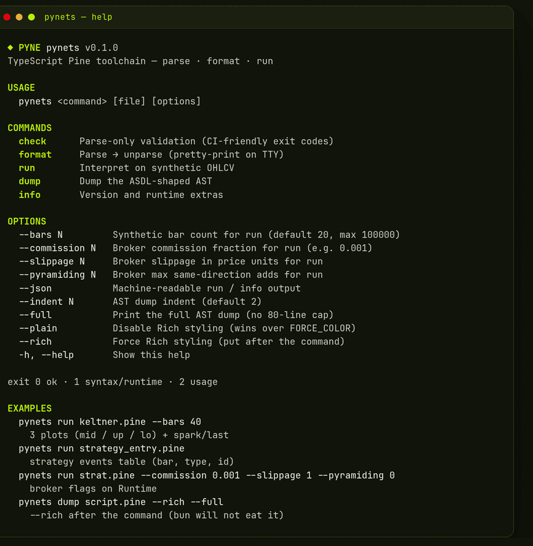
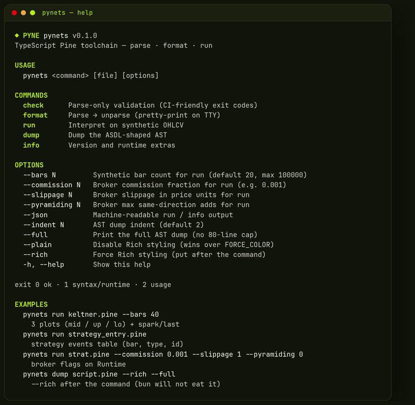
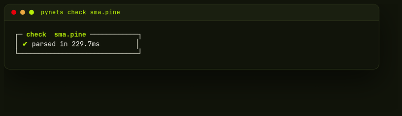
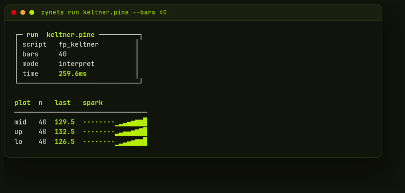
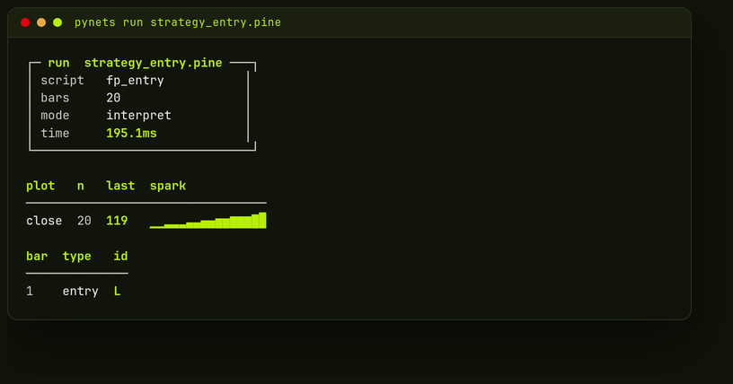
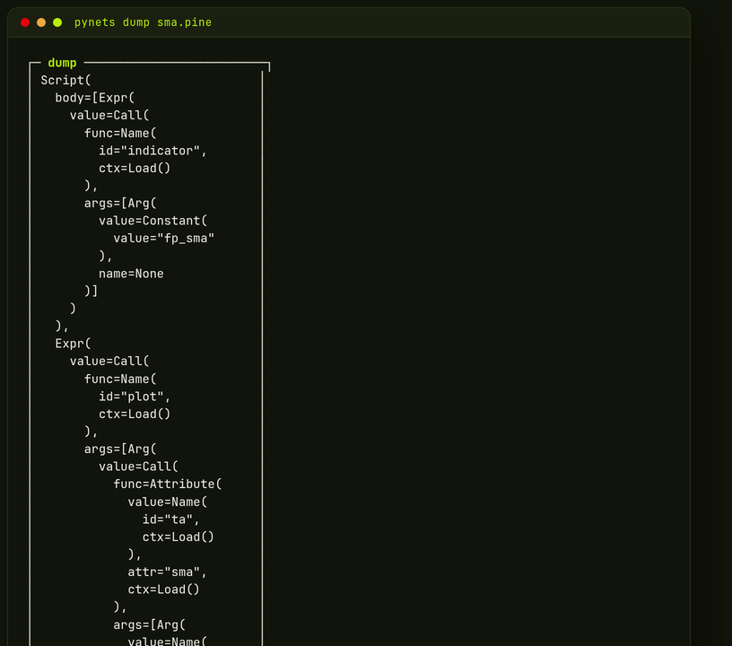

# PyneTS

TypeScript / Bun library for **Pine Script**: parse, unparse, and interpret.

<p align="center">
  
</p>

Same public names as Python [`pynescript`](https://github.com/hoox-sh/pyne): `parse`, `unparse`, `Runtime.run`.
Python `pynescript.runtime` is the **source of truth**. When semantics disagree, Python wins. This is not a TradingView platform certification.

```ts
import { parse, unparse, Runtime } from "@hoox-sh/pynets";

const src = `//@version=5
indicator("sma")
plot(ta.sma(close, 3))
`;

const tree = parse(src);
unparse(tree);

const out = new Runtime("AAPL").run(src, [
  { close: 1 }, { close: 2 }, { close: 3 }, { close: 4 },
]);
// out.plots, out.series, out.count
```

Install with Bun (published TypeScript source — no bundle needed):

```bash
bun add @hoox-sh/pynets
bunx pynets -- help
```

Node and browsers use the Bun-built ESM in `dist/` (`bun run build`; `npm pack` runs it via `prepack`):

```bash
# Node 20+
npm install @hoox-sh/pynets
```

```js
import { parse, Runtime } from "@hoox-sh/pynets";
```

```html
<script type="module">
  import { Runtime } from "https://esm.sh/@hoox-sh/pynets";
</script>
```

The CLI still needs Bun on `PATH`. This is not a Cloudflare Worker package.

<p align="center">
  
</p>

---

## Where this repo wins

Most TypeScript Pine ports rewrite the language. PyneTS does not. It is the library-shaped port of **PYNE**: the same ANTLR grammar, the same ASDL field names, the same interpret contract.

| | Typical JS Pine runtime | **PyneTS** |
|---|---|---|
| Grammar | Hand-rolled or a forked copy | **Shared PYNE `.g4`**, TS ANTLR target — not forked here |
| AST | Custom / Zod (`Identifier`, `Literal`) | **ASDL names** (`kind`, `lineno`, `col_offset`) |
| Semantics | “Looks like Pine” | **Python Runtime wins** — every builtin is ported against `pynescript` |
| `na` | `NaN`, `undefined`, or thrown | **`null`**. `na == na` is true. Non-finite in/out is `na` |
| Lookback | Off-by-one or OOB crash | `close[1]` is previous; OOB / negative → `na` |
| Foreign data | Silently reuse the chart | `request.security` **without data is `na`** — we do not invent bars |
| Strategy | Events only, or a stats demo | **Fills, ledger, `strategy.risk.*`, OCA** |
| Matrix | Add/multiply if you are lucky | **`inv` / `pinv` / eigen / rank / kron** |
| Libraries | Unresolved `import` dies | **In-process registry** + soft stubs |
| Arrays | Push/get | **Near-full `array.*`** including search, percentiles, stdev |
| Host API | Ad-hoc | **`Runtime.run` / `stream` / `runProvider`** — same envelope as Python |
| CLI | None or a toy | **`check` / `format` / `run` / `dump` / `info`** — pipes stay JSON |

Family map — library vs edge host, same SoT:

| | [pynescript](https://github.com/hoox-sh/pyne) | [pyne-worker](https://github.com/hoox-sh/pyne-worker) | **PyneTS** |
|---|---|---|---|
| Role | SoT library | Production **Python** Cloudflare Worker | TS / Bun library + CLI |
| Engine | interpret + Numba compile | Vendors `pynescript.runtime` | interpret only |
| Grammar | `*.g4` | Same Python engine (not a fork) | **same `.g4`**, TS ANTLR target |
| How you call it | `Runtime.run` | `POST /run` (`interpret` / `compile` / `auto`) | `Runtime.run` / `stream` / `runProvider` |
| Extra | LSP, Pro API | R2 OHLCV, 1m cron, alerts, trade-worker | Local TTY (`check` / `format` / `run` / `dump`) |

[pyne-worker](https://github.com/hoox-sh/pyne-worker) is the edge evaluate host of the **Python** engine. PyneTS is the TypeScript library you import and the CLI you run on a laptop. They share the PYNE contract; this repo is not a Worker.

This repository is the standalone `@hoox-sh/pynets` checkout. PYNE consumes it **only** as the `pynets/` git submodule — never copy sources back into `hoox-sh/pyne`.

---

## Runtime contract

These are the rules that make plots match Python. Other ports usually get them wrong.

- **`na` is `null`.** A non-finite number in or out becomes `na`.
- **`na == na` is true.** Any other comparison involving `na` is false.
- **Series lookback:** `x[0]` current, `x[1]` previous, out of range → `na`.
- **TA is one sample per bar**, state keyed by call-site (Python incremental kernels).
- **Foreign / HTF `request.security` without a feed → `na`.** The chart series is never silently reused as another symbol.
- **v3/v4 bare aliases** (`sma`, `ema`, `rsi`, …) resolve when Python does.

```ts
const out = new Runtime("TEST").run(
  `indicator("t")
plot(close[1])
plot(na == na ? 1 : 0)`,
  [{ close: 10 }, { close: 20 }],
);
// plots[0] last bar = 10 (previous close)
// plots[1] = 1
```

---

## What interpret covers

Wired through one dispatcher (`src/runtime/interpret.ts`). Not a second engine.

**Language** — `var` / `varip` / `:=`, tuples, `if` / `for` / `while` / `switch`, UDFs, `type` / `enum`, `import`, `library()`.

**`ta.*`** — SMA/EMA/RMA/WMA/VWMA/HMA/ALMA/DEMA/TEMA/KAMA/SWMA, RSI, ATR, Supertrend, Keltner, BB/BBW, MACD, Stoch, CCI, WPR, DMI/ADX, SAR, MFI, CMO, TSI, COG, stdev/dev/variance, highest/lowest, crossover/crossunder, volume (OBV, PVT, AD, WAD, NVI/PVI, III, WVAD), pivots, barssince, valuewhen, percentiles, and the v3/v4 bare names.

**`math.*` / `str.*` / `color.*` / `input.*` / `log.*`** — the Python set, including `nz`, `iff`, `fixnan`, `timestamp`, `weekofyear`, `time_tradingday`.

**`array.*`** — new/from, get/set, push/pop/shift/unshift, slice/copy/concat, sort/search (binary + leftmost/rightmost), aggregates (avg/min/max/sum/median/mode/range/stdev/variance/covariance), percentiles, standardize, sort_indices.

**`matrix.*`** — shape ops, predicates, `mult` / `inv` / **`pinv`** / `pow` / `kron` / `rank` / **eigenvalues / eigenvectors**.

**`strategy.*`** — entry/exit/order, pending limit/stop, commission/slippage/pyramiding, open/closed trade accessors, **`strategy.risk.*`**, **OCA cancel/reduce**.

**Drawings / alerts** — `line` / `label` / `box` / `table` events; `alert` / `alertcondition`.

---

## Run scripts

```ts
import { Runtime } from "@hoox-sh/pynets";

const rt = new Runtime("AAPL", {
  timeframe: "5",
  broker: { commission: 0.001, slippage: 0, pyramiding: 0 },
});

const result = rt.run(source, bars);
// result.plots          last values, plot order
// result.series         titled series (plot, strategy fields, …)
// result.plot_data      { title: { data: [{ value, time? }] } }
// result.events         strategy events
// result.fills          fill tape
// result.drawings       line/label/box/table
// result.logs           log.info / warning / error
// result.error          set on parse/runtime failure (does not throw)
```

Push-driven re-eval:

```ts
const stream = rt.stream(source);
stream.on("bar", (out) => { /* one result per push */ });
stream.push({ close: 1 });
stream.push({ close: 2 });
stream.end();
```

### Bars you actually have

Hosts feed OHLCV. PyneTS will not invent a foreign market.

```ts
import { MemoryProvider, StaticMapProvider, JsonBarProvider } from "@hoox-sh/pynets";

await rt.runProvider(source, new MemoryProvider(bars), { limit: 500 });

// In-process symbol map (tests, fixtures, your own cache)
const map = new StaticMapProvider({
  "AAPL": bars,
  "AAPL:60": htfBars,
});

// Generic JSON GET — inject fetch, no vendor URLs baked in
const http = new JsonBarProvider({
  url: ({ symbol, timeframe, limit }) => `https://you.example/ohlcv?s=${symbol}&tf=${timeframe}&n=${limit}`,
  fetch: globalThis.fetch,
});
```

### Libraries

```ts
rt.registerLibrarySource(
  "User",
  "MathLib",
  1,
  `//@version=5
library("MathLib")
export double(x) => x * 2`,
);

rt.run(
  `indicator("t")
import User/MathLib/1 as ml
plot(ml.double(close))`,
  bars,
);
```

Unresolved remote imports bind a soft stub (known helpers such as `index_2d_to_1d` still work). Register a source when you want real exports.

---

## CLI

Rich TTY (PYNE volt palette). Pipes and CI stay plain: `check` prints `ok`, `run` / `info` print JSON.

<p align="center">
  
</p>
<p align="center">
  
</p>
<p align="center">
  
</p>
<p align="center">
  
</p>

```bash
bunx pynets -- help
bunx pynets -- check script.pine
bunx pynets -- format script.pine
bunx pynets -- run script.pine --bars 20
bunx pynets -- run strat.pine --commission 0.001 --slippage 1 --pyramiding 0
bunx pynets -- dump script.pine --rich --full
bunx pynets -- info
```

Put `--rich` / `--plain` **after** the command so `bun run` does not swallow them. `--plain` wins over leftover `FORCE_COLOR`. Exit codes: `0` ok, `1` syntax/runtime, `2` usage.

`run` prints a sparkline + last-value row per plot, a strategy events table when present, and drawings/alerts when present. `--plain` is machine JSON.

| Flag | Effect |
| --- | --- |
| `--bars N` | Synthetic bar count for `run` (default 20, max 100000) |
| `--commission N` | Broker commission fraction (`0.001` = 0.1%) |
| `--slippage N` | Slippage in price units |
| `--pyramiding N` | Max same-direction adds |
| `--json` | Machine-readable `run` / `info` |
| `--full` | Full AST dump (no 80-line cap on `--rich`) |
| `--plain` | Disable styling |
| `--rich` | Force panels / sparklines |

---

## Public API

```ts
import {
  parse, unparse, dump, tokenize, PinescriptSyntaxError,
  Runtime, RuntimeStream,
  PineArray, PineMap, PineMatrix,
  MemoryProvider, StaticMapProvider, JsonBarProvider,
  LibraryRegistry,
} from "@hoox-sh/pynets";
```

`src/index.ts` is the stable barrel. Generated ANTLR, parser internals, and CLI helpers are not re-exported.

---

## Development

Agent brief: [`AGENTS.md`](AGENTS.md) · contribute: [`CONTRIBUTING.md`](CONTRIBUTING.md) · changes: [`CHANGELOG.md`](CHANGELOG.md)

```bash
git clone https://github.com/hoox-sh/pynets.git
cd pynets
bun install
bun test
bun run typecheck
```

Generated files under `src/generated/` are committed so `bun test` does not require Java. Local development is Bun only — do not add npm/yarn/pnpm lockfiles.

### Grammar (do not fork)

`bun run generate` needs the shared PYNE `.g4` files. They are **not** vendored here.

Resolution (`scripts/generate-antlr.ts`): `PYNETS_GRAMMAR` → `PYNESCRIPT_ROOT` → parent PYNE checkout → sibling `../pynescript` or `../pyne`.

```bash
# PYNE cloned next to this repo
bun run generate

# or
PYNESCRIPT_ROOT=/path/to/pyne bun run generate
```

Java is required only to regenerate. The ANTLR jar is cached in `.tools/` (gitignored).

### Inside PYNE

```bash
git clone --recurse-submodules https://github.com/hoox-sh/pyne.git
cd pyne/pynets
bun install && bun test
```

After a plain clone: `git submodule update --init --recursive`.

---

## Non-goals

Numba / compile, Worker packaging, ASDL codegen. Interpret is the only backend.

---

## License

AGPL-3.0-or-later — same as PYNE. See [LICENSE](LICENSE) and [NOTICE](NOTICE).
